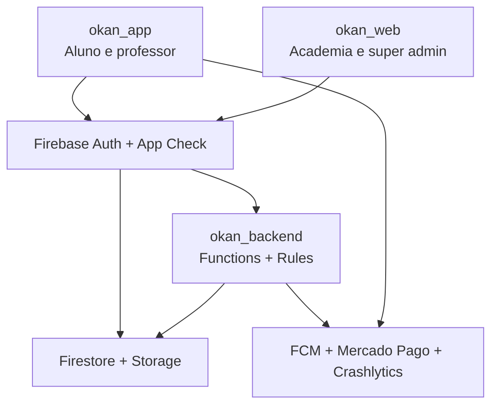

# Okan

Okan é um ecossistema digital de acompanhamento de treino que conecta alunos, profissionais de educação física e academias. O produto combina prescrição e execução de treinos, acompanhamento de evolução, relacionamento profissional, comunicação, comunidade e monetização em uma única experiência.

> **Estado da documentação:** este README e os documentos em `docs/` descrevem o estado consolidado do código em **1º de setembro de 2026**. Quando uma capacidade existe apenas como destino arquitetural, ela é identificada como planejada ou dívida técnica.

## Problema que o Okan resolve

O acompanhamento de treino costuma ficar fragmentado entre fichas, mensagens, planilhas, aplicativos genéricos e sistemas administrativos sem integração. Isso prejudica a continuidade entre o treino prescrito, a execução do aluno, o feedback, a avaliação física e a gestão comercial da academia.

O Okan centraliza esse ciclo:

- o aluno consulta e executa sua ficha, registra carga e feedback e acompanha sua evolução;
- o professor administra alunos vinculados, treinos, avaliações e notas privadas;
- a academia gerencia cadastro, licenças de profissionais e assinatura B2B;
- a plataforma oferece chat, notificações, Arena, templates e loja de treinos.

## Diferencial do produto

O diferencial não é apenas digitalizar uma ficha de treino. Okan integra três lados do mesmo ecossistema — aluno, profissional e academia — e mantém o contexto entre prescrição, execução, relacionamento e comunidade. A arquitetura também separa persona funcional (`memberType`) de autorização (`role`), permitindo que uma mesma identidade administrativa use o aplicativo como aluno ou professor sem transformar relacionamento em privilégio.

## Repositórios

| Repositório | Responsabilidade | Tecnologia principal |
| --- | --- | --- |
| [`okan_app`](https://github.com/arthurcmps/okan_app) | Aplicativo para aluno/professor e entrada principal da documentação | Flutter/Dart |
| [`okan_web`](https://github.com/arthurcmps/okan_web) | Painel administrativo B2B para academia e super admin | HTML, CSS e JavaScript ES Modules |
| [`okan_backend`](https://github.com/arthurcmps/okan_backend) | Backend canônico: Functions, Rules, índices, testes e scripts operacionais | Firebase, Node.js 24 |

`okan_backend` é a única fonte canônica de Cloud Functions, Firestore Rules, Storage Rules e índices. Não devem ser reintroduzidas cópias de infraestrutura em `okan_app` ou `okan_web`.

## Arquitetura resumida



Regra de confiança: **o cliente solicita; o backend valida, decide e persiste qualquer estado privilegiado, financeiro ou de entitlement**.

## Tecnologias

- Flutter 3.47.0, Dart, Provider e repositories orientados por domínio;
- Firebase Authentication, Firestore, Storage, Cloud Functions v2, App Check, FCM e Crashlytics;
- Node.js 24, Firebase Admin SDK, Firebase Local Emulator Suite e Node Test Runner;
- painel web estático em HTML/CSS/JavaScript ES Modules com Firebase JS 10.8.0;
- Mercado Pago para pagamentos e assinaturas;
- GitHub Actions para Flutter, Functions e Firebase Rules.

## Pré-requisitos

- Flutter compatível com o lockfile do projeto; a CI usa Flutter `3.47.0`;
- Android Studio/Android SDK e Java 17 para o app;
- Node.js 24 e npm para o backend;
- Java 21 para o Firestore Emulator na suíte de Rules;
- Firebase CLI compatível com o lockfile do backend.

## Rodar em DEV

DEV é local e usa `demo-okan-dev`. App Check, FCM, Crashlytics e pagamentos externos ficam desativados.

Terminal 1:

```bash
cd ../okan_backend
npm ci
npm run dev:emulators
```

Terminal 2 — Android Emulator (target com flavors configurados atualmente):

```bash
flutter pub get
flutter run --flavor dev \
  --dart-define=OKAN_ENV=dev \
  --dart-define=OKAN_EMULATOR_HOST=10.0.2.2
```

Para desktop/web local, use `127.0.0.1`. Em aparelho Android físico via USB, execute `adb reverse` para as portas `9099`, `8080`, `5001` e `9199` e use `127.0.0.1` como host.

## Rodar em STAGING

STAGING usa o Firebase cloud isolado `okan-staging-24829`, habilita App Check, FCM e Crashlytics no Android, bloqueia pagamentos externos e falha se qualquer configuração obrigatória estiver ausente ou apontar para outro projeto. O comando abaixo é o fluxo Android atualmente configurado; schemes equivalentes ainda precisam ser criados antes de usar `--flavor` no iOS.

```bash
flutter run --flavor staging \
  --dart-define=OKAN_ENV=staging \
  --dart-define=OKAN_STAGING_FIREBASE_PROJECT_ID=okan-staging-24829 \
  --dart-define=OKAN_STAGING_FIREBASE_MESSAGING_SENDER_ID=<sender-id> \
  --dart-define=OKAN_STAGING_FIREBASE_STORAGE_BUCKET=<bucket> \
  --dart-define=OKAN_STAGING_FIREBASE_WEB_API_KEY=<web-api-key> \
  --dart-define=OKAN_STAGING_FIREBASE_WEB_APP_ID=<web-app-id> \
  --dart-define=OKAN_STAGING_FIREBASE_WEB_AUTH_DOMAIN=<auth-domain> \
  --dart-define=OKAN_STAGING_FIREBASE_ANDROID_API_KEY=<android-api-key> \
  --dart-define=OKAN_STAGING_FIREBASE_ANDROID_APP_ID=<android-app-id> \
  --dart-define=OKAN_STAGING_FIREBASE_IOS_API_KEY=<ios-api-key> \
  --dart-define=OKAN_STAGING_FIREBASE_IOS_APP_ID=<ios-app-id> \
  --dart-define=OKAN_STAGING_FIREBASE_IOS_BUNDLE_ID=com.sankofa.okan
```

Valores por ambiente devem permanecer fora de commits e nunca podem ser copiados de PROD para STAGING. O painel `okan_web` ainda possui configuração Firebase de PROD no código; seu modo STAGING próprio continua pendente.

## Validação local

```bash
flutter analyze --no-fatal-infos --no-fatal-warnings
flutter test
```

No backend:

```bash
npm ci
npm run test:rules
cd functions
npm ci
npm run lint
npm test
```

## Documentação mestre

- [Termo de Abertura](docs/PROJECT-CHARTER.md)
- [Arquitetura Geral](docs/ARCHITECTURE.md)
- [Modelo de Dados](docs/DATA-MODEL.md)
- [Regras de Negócio](docs/BUSINESS-RULES.md)
- [Autorização e Segurança](docs/SECURITY.md)
- [Ambientes](docs/ENVIRONMENTS.md)
- [Roadmap Técnico](docs/ROADMAP.md)

Os documentos de ticket existentes permanecem como histórico de implementação. Os documentos mestres representam o estado atual e devem ser atualizados quando um ticket alterar um contrato neles descrito.

## Convenção de contribuição

- branch por ticket, por exemplo `quality/okan-040-crashlytics-logs`;
- Pull Request para `main` com CI verde;
- nenhuma mudança de Rules sem Emulator tests;
- nenhum deploy genérico de Firebase: selecionar explicitamente o ambiente e o target;
- nenhuma credencial, token, dado médico ou dado financeiro sensível em Git ou logs.
