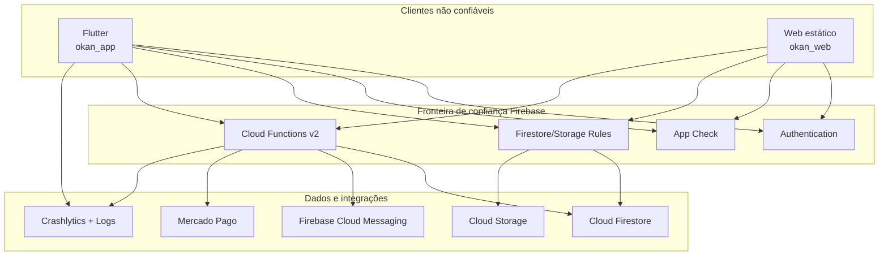
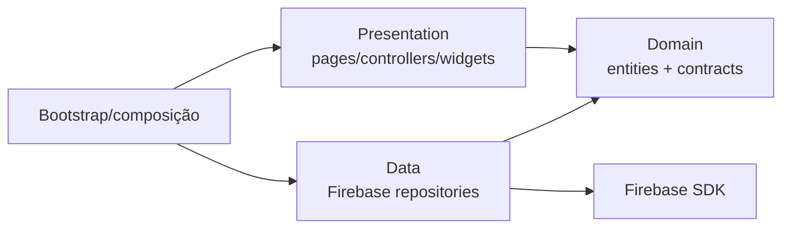
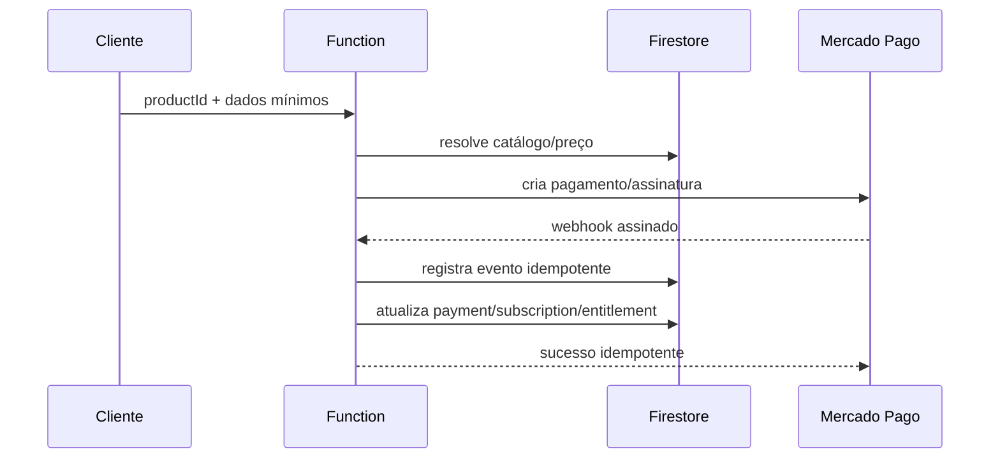

# Arquitetura Geral do Okan

**Estado:** as-is consolidado com destino arquitetural explícito  
**Revisado em:** 1º de setembro de 2026

## 1. Visão geral

O Okan é composto por três repositórios independentes que compartilham o mesmo backend Firebase:

- `okan_app`: experiência Flutter para aluno e professor;
- `okan_web`: painel administrativo B2B e de operação;
- `okan_backend`: autoridade canônica de infraestrutura e regras server-side.



## 2. Princípios

1. **Cliente não é autoridade.** Preço, Premium, entitlement, role, licença e confirmação de pagamento pertencem ao backend.
2. **Segurança independe da UI.** Botão oculto não concede nem remove permissão.
3. **Backend único.** Functions, Rules e índices partem de `okan_backend`.
4. **Migração aditiva.** Leitores compatíveis precedem remoção de legado.
5. **Fail-closed de ambiente.** Valor inválido ou configuração STAGING incompleta interrompe o bootstrap.
6. **Repository por domínio.** Flutter não usa repository Firestore genérico.

## 3. Flutter — `okan_app`

### 3.1 Stack

- Flutter/Dart;
- Provider para estado existente e injeção pontual;
- Firebase Auth, Firestore, Storage, Functions, FCM, App Check e Crashlytics;
- repositories orientados por domínio.

### 3.2 Organização atual

```text
lib/
├── core/
│   ├── config/
│   ├── services/
│   ├── theme/
│   └── widgets/
└── features/
    ├── arena/
    ├── assessments/
    ├── auth/
    ├── chat/
    ├── notifications/
    ├── store/
    ├── students/
    ├── tasks/
    └── workouts/
```

As features migradas usam `domain`, `data` e `presentation`. Caminhos antigos dentro de `features/auth` permanecem, em alguns casos, como exports de compatibilidade. Auth/Profile ainda concentram acessos diretos legados e são dívida de modularização.

### 3.3 Dependências entre camadas



- `domain` não importa Firebase nem Flutter UI;
- `presentation` depende de contratos/entidades, não de Firestore/Functions;
- `data` traduz snapshots, timestamps, erros e payloads;
- testes arquiteturais impedem novos acessos diretos em apresentação fora do baseline explícito.

### 3.4 Bootstrap

`main.dart` resolve o ambiente, inicializa Firebase, Crashlytics, App Check, SharedPreferences, FCM, localização e Provider. O Firebase inicializado é validado contra o `projectId` esperado antes de a UI iniciar.

## 4. Web — `okan_web`

O painel é uma aplicação estática sem framework ou bundler:

```text
public/
├── index.html
├── register.html
├── dashboard.html
├── css/
└── script/
    ├── firebase.js
    ├── dashboard.js
    ├── models/
    ├── modules/
    ├── services/
    └── utils/
```

Firebase JS 10.8.0 é carregado por CDN. O código usa ES Modules, serviços para cadastro/licenças/assinatura e utilitários seguros de DOM após o hardening de XSS do OKAN-029.

**Limitação atual:** `public/script/firebase.js` contém configuração de PROD. O painel administrativo ainda não possui seleção DEV/STAGING/PROD equivalente à do Flutter.

## 5. Firebase

### 5.1 Authentication

- e-mail/senha e Google no app;
- e-mail/senha e Google no painel;
- o UID do Firebase Auth deve coincidir com `users/{uid}`;
- Auth prova identidade, não autorização de domínio.

### 5.2 Firestore

Firestore é o banco operacional. Security Rules protegem acesso client-side; Functions usam Admin SDK e validam explicitamente autenticação, papel, persona, ownership e estado.

O banco canônico está em `southamerica-east1`. Os contratos estão em [DATA-MODEL.md](DATA-MODEL.md).

### 5.3 Storage

Caminhos ativos:

- `user_photos/{uid}.jpg` — avatar atual;
- `profile_photos/{uid}.jpg` — compatibilidade legada;
- `arena_duels/{challengeId}/{timestamp}_{uid}.jpg` — imagens de duelo.

O fallback global nega qualquer outro caminho.

### 5.4 App Check

- desativado em DEV;
- ativado no Flutter em STAGING/PROD com Debug Provider fora de release e Play Integrity/DeviceCheck em release;
- ativado no painel PROD com reCAPTCHA v3.

A ativação do cliente não equivale a enforcement. As Callables atuais não declaram `enforceAppCheck: true`; essa proteção server-side deve ser tratada como hardening pendente e validada por ambiente.

### 5.5 FCM

Clientes gravam notificações em `users/{uid}/notifications`. Em PROD, o entrypoint legado contém um trigger que lê `fcmTokens` e envia push. DEV desativa o bootstrap de FCM. STAGING habilita o cliente, mas o conjunto de Functions implantado intencionalmente não inclui o trigger genérico.

### 5.6 Crashlytics

Android STAGING/PROD coleta falhas fatais Flutter e assíncronas e anexa somente `okan_environment` e `okan_platform`. DEV desativa coleta. iOS/macOS/web permanecem fail-closed no serviço atual.

## 6. Cloud Functions

### 6.1 Entry point compatível

`functions/package.json` usa `compatibility_index.js`.

- em PROD, ele agrega as Functions legadas de `index.js` e as Functions canônicas novas;
- em STAGING, ele não carrega `index.js`, impedindo deploy acidental de pagamentos, push genérico e schedules.

### 6.2 Região

- novas Callables e triggers de compatibilidade: `southamerica-east1`;
- Functions legadas de pagamento/push: região padrão `us-central1` durante a migração;
- Firestore: `southamerica-east1`.

### 6.3 Functions canônicas em `southamerica-east1`

| Function | Tipo | Responsabilidade |
| --- | --- | --- |
| `registerAcademy` | Callable | cria perfil `gym_admin` e academia em transação |
| `grantAcademyLicense` | Callable | concede licença e incrementa uso atomicamente |
| `revokeAcademyLicense` | Callable | revoga licença e decrementa uso atomicamente |
| `createStudentInvite` | Callable | valida professor, aluno, plano e cria convite |
| `respondStudentInvite` | Callable | aceita/rejeita convite e cria vínculo canônico |
| `cancelStudentInvite` | Callable | cancela convite pendente do professor |
| `unlinkStudent` | Callable | remove vínculo do professor atual |
| `observarEscritasLegadasUserV2` | Firestore trigger | registra métricas agregadas de campos legados |
| `registrarHeartbeatCompatibilidadeUserV2` | Firestore trigger | inicia/atualiza janela de observação User v2 |

### 6.4 Functions legadas agregadas somente fora de STAGING

Incluem catálogo/pagamentos, entitlements, assinatura do professor, assinatura B2B, webhook Mercado Pago, push genérico e expiração agendada. Permanecem no backend canônico, mas a coexistência de regiões é dívida controlada.

## 7. Pagamentos



- o cliente envia `productId`, nunca preço confiável;
- templates vendáveis precisam ser oficiais (`personalId=SYSTEM_ADMIN`);
- `payments/{providerPaymentId}` é o registro financeiro sanitizado;
- `webhook_events/{notificationId}` impede reprocessamento;
- entitlements ficam em `users/{uid}/entitlements` e são backend-only;
- segredos são `MERCADO_PAGO_ACCESS_TOKEN` e `MERCADO_PAGO_WEBHOOK_SECRET`.

## 8. Fluxo entre repositórios

| Mudança | Repositório de origem | Consumidores coordenados |
| --- | --- | --- |
| Nova regra/coleção | `okan_backend` | app + web + testes de Rules |
| Nova Callable | `okan_backend` | repository/service do cliente + contrato |
| Nova feature mobile | `okan_app` | backend se houver mutação privilegiada |
| Nova operação B2B | `okan_web` | backend e Rules |
| Mudança de ambiente | todos afetados | validação cruzada de project ID |

Nenhum cliente deve implantar infraestrutura. Alterações de contrato precisam ser compatíveis durante a ordem de rollout: backend permissivo para o novo contrato, cliente, observação e somente depois remoção do legado.

## 9. Estado atual versus destino

| Tema | Estado atual | Destino |
| --- | --- | --- |
| Backend | canônico e centralizado | manter |
| Flutter | features principais modularizadas | separar Auth/Profile remanescentes |
| Web por ambiente | PROD hardcoded | configuração DEV/STAGING/PROD fail-closed |
| Functions | duas regiões/entrypoint compatível | região e contratos consolidados |
| `users` | leitura ampla para autenticados | `public_profiles` mínimo + dados privados fechados |
| Notificações | criação client-side permitida | criação server-side/autorizada por evento |
| App Check Functions | não exigido em código | `enforceAppCheck` com rollout controlado |
| Storage avatar | caminho atual + legado | um único caminho, com MIME validado |
| User v1 | fallback monitorado | sunset após evidência e aprovação manual |

## 10. Fontes de verdade

1. código e testes de `okan_backend` para autorização e contratos server-side;
2. este documento para visão consolidada;
3. [DATA-MODEL.md](DATA-MODEL.md) para persistência;
4. [BUSINESS-RULES.md](BUSINESS-RULES.md) para regras funcionais;
5. [SECURITY.md](SECURITY.md) e [ENVIRONMENTS.md](ENVIRONMENTS.md) para controles transversais;
6. documentos `OKAN-*` para histórico e evidência de implementação.
