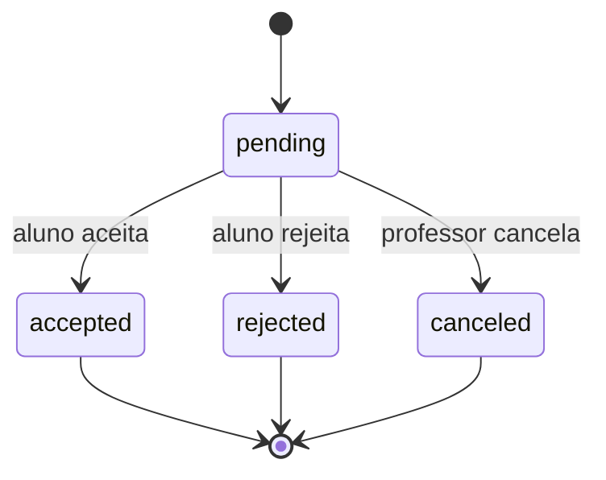

# Regras de Negócio do Okan

**Revisado em:** 1º de setembro de 2026  
**Escopo:** regras funcionais e invariantes compartilhados por app, web e backend

## 1. Identidade, papel e persona

### BR-001 — Identidade canônica

- cada usuário autenticado possui no máximo um documento `users/{uid}`;
- o ID do documento é a fonte de verdade do UID;
- `schemaVersion=2` identifica o contrato atual;
- e-mail no cadastro deve coincidir com o token do Firebase Auth.

### BR-002 — Role não é persona

- `role` controla RBAC: `aluno`, `professor`, `gym_admin`, `super_admin`;
- `memberType` controla a experiência mobile: `aluno` ou `professor`;
- relacionamento, assinatura ou `academyId` não concedem role;
- `super_admin` pode possuir `memberType=aluno` ou `professor`;
- clientes não podem alterar `role`, `memberType` privilegiado ou campos de autorização após o cadastro.

### BR-003 — Quem pode atuar como professor

Para operações de vínculo profissional, o backend exige:

- `schemaVersion >= 2`;
- `role` pertencente ao conjunto canônico;
- `memberType=professor`.

O termo legado “personal” é aceito apenas na leitura de documentos antigos. Novas operações devem usar a semântica canônica.

## 2. Planos do professor

### BR-010 — Plano Base

- gratuito;
- permite no máximo **3 posições**, somando alunos ativos e convites pendentes;
- duas queries, canônica (`professorId`) e legada (`personalId`), são deduplicadas por UID;
- convite já pendente não consome nova posição.

### BR-011 — Mestre Sankofa

- assinatura mensal de **R$ 49,90** no catálogo server-side;
- produto: `personal_mestre_sankofa_monthly`;
- Premium só é ativo quando `subscriptions/{uid}.status=active` e `currentPeriodEnd` está no futuro;
- cancelamento ao fim do período mantém acesso até `currentPeriodEnd`;
- cliente não pode ativar Premium nem modificar o preço.

## 3. Convites e vínculo profissional

### BR-020 — Criação de convite

Somente usuário autenticado com persona de professor pode convidar. O aluno:

- deve existir;
- deve ser User v2 canônico com `memberType=aluno`;
- não pode ser o próprio professor;
- não pode já estar vinculado ao mesmo ou a outro professor.

O ID do convite é determinístico por par professor–aluno. A criação grava também uma notificação para o aluno na mesma transação.

### BR-021 — Estados do convite

- somente o aluno destinatário aceita ou rejeita;
- somente o professor autor cancela;
- repetir a mesma operação concluída deve ser idempotente quando seguro;
- convite processado para outro estado não pode ser reaberto implicitamente.

### BR-022 — Aceite e vínculo

- aceitar grava `users/{studentId}.professorId`;
- novo aceite não recria `users.personalId`;
- aluno possui no máximo um professor atual;
- o convite e o vínculo são atualizados transacionalmente.

### BR-023 — Desvinculação

- somente o professor atualmente vinculado pode desvincular o aluno pelo fluxo existente;
- operação remove `professorId` e campos legados de relacionamento quando presentes;
- repetir desvinculação de vínculo já ausente é idempotente;
- desvincular não remove conta, histórico, avaliações ou treinos.

## 4. Treinos

### BR-030 — Propriedade da ficha

- `workout_plans/{studentId}` pertence ao aluno indicado pelo ID;
- aluno e professor vinculado podem ler e atualizar;
- somente professor vinculado exclui a ficha inteira;
- exercícios são organizados pelas chaves `segunda` a `domingo`.

### BR-031 — Execução

- aluno pode marcar conclusão, carga, feedback e solicitação de alteração;
- ao finalizar um dia, o app cria um registro em `workout_history`;
- a ficha semanal é preservada para reutilização;
- `concluido` volta a `false` após finalizar;
- feedback pode ser limpo conforme o fluxo;
- histórico não deve mudar o `studentId` após criação.

### BR-032 — Validade

- professor pode definir `validade`;
- `avisadoVencimento` impede aviso repetido;
- renovar validade redefine `avisadoVencimento=false`.

### BR-033 — Modelos privados

- professor cria/altera/exclui apenas `workouts` com seu `personalId`;
- leitura ampla autenticada de `workouts` é compatibilidade e não deve orientar novos fluxos.

## 5. Anamnese, avaliações e notas

### BR-040 — Anamnese

- o aluno administra a própria anamnese;
- professor vinculado possui leitura, não escrita;
- outro aluno, professor não vinculado e gym admin não recebem acesso;
- o conteúdo é dado pessoal sensível e não pode aparecer em logs.

### BR-041 — Avaliações físicas

- aluno e professor vinculado podem criar, ler, atualizar e excluir;
- avaliação + resumo físico no usuário são gravados no mesmo batch;
- IMC é derivado de peso/altura; não concede permissão nem role.

### BR-042 — Notas privadas

- cada nota pertence ao professor cujo UID é o ID do documento;
- somente o professor atualmente vinculado lê/grava/exclui;
- o aluno não possui leitura pelo contrato atual;
- gym admin e super admin não recebem acesso automático.

## 6. Academia e licenças

### BR-050 — Cadastro de academia

- o usuário já deve estar autenticado, mas não pode possuir perfil Firestore incompatível;
- `registerAcademy` cria academia e perfil `gym_admin` na mesma transação;
- `ownerUid` da academia e `academyId` do usuário devem formar relação bidirecional coerente;
- repetição coerente retorna `alreadyRegistered`; conflito falha.

### BR-051 — Ownership

Gym admin só administra uma academia quando:

1. `users/{uid}.role=gym_admin`;
2. `users/{uid}.academyId=academyId` (fallback legado temporário permitido);
3. `academias/{academyId}.ownerUid=uid`.

Super admin pode realizar operações administrativas previstas, mas não ganha acesso automático a dados médicos.

### BR-052 — Capacidade

- `licencasTotais` e `licencasUsadas` são server-owned;
- nunca pode existir `licencasUsadas > licencasTotais`;
- concessão cria vínculo e incrementa contador na mesma transação;
- revogação remove vínculo e decrementa na mesma transação;
- contador nunca fica negativo;
- concessão repetida para o mesmo e-mail é idempotente.

### BR-053 — Assinatura B2B

- preço atual: **R$ 45,00 por licença/mês**;
- quantidade deve ser inteiro positivo e não pode ser menor que `licencasUsadas`;
- dia de cobrança deve estar entre 1 e 28;
- valor total é calculado no backend;
- academia ligada ao motor legado não pode abrir uma segunda assinatura canônica;
- uma academia não pode ter duas assinaturas em estado bloqueante (`creating`, `active` ou `paused`);
- reconciliação com o provedor é idempotente e ativa capacidade somente após estado financeiro elegível.

### BR-054 — Cancelamento B2B

- gym admin pode solicitar cancelamento da própria academia;
- cliente só agenda cancelamento; não reativa estado financeiro;
- cancelamento efetivo e reconciliação pertencem ao backend/provedor;
- exclusão da academia inteira é operação de super admin, não substituto do cancelamento.

## 7. Catálogo, templates e loja

### BR-060 — Catálogo global

- `exercises` tem leitura autenticada;
- somente super admin cria, altera ou exclui;
- o app não deve usar telas ocultas ou e-mail hardcoded como autoridade.

### BR-061 — Templates pessoais

- professor cria/altera/exclui template cujo `personalId` é o próprio UID;
- templates pessoais não se tornam automaticamente produtos oficiais;
- proprietário não pode assumir `SYSTEM_ADMIN`.

### BR-062 — Templates oficiais

- `personalId=SYSTEM_ADMIN` identifica produto oficial;
- somente super admin administra;
- `fichas` é o formato atual de múltiplas fichas;
- `exercicios` continua como compatibilidade/Ficha A;
- preço e disponibilidade são resolvidos pelo backend.

### BR-063 — Aquisição

- cliente envia `productId=workout_template:<templateId>`;
- template pago exige pagamento aprovado;
- template gratuito só pode ser adquirido se o preço server-side for zero;
- entitlement é determinístico e concedido uma única vez;
- `purchased_templates` pode ser atualizado apenas como compatibilidade backend.

## 8. Pagamentos e assinaturas

### BR-070 — Catálogo server-side

- preço enviado pelo cliente é ignorado;
- produto inexistente/inativo é rejeitado;
- template vendável precisa existir e ser oficial;
- moeda atual é BRL.

### BR-071 — Dados de cartão

- tokenização usa chave pública e ocorre no cliente/SDK do provedor;
- Access Token privado permanece em Secret Manager;
- número de cartão, CVV, token e CPF não são persistidos em Firestore nem logs;
- backend recebe somente tokenização e dados mínimos para processar.

### BR-072 — Ledger e fulfillment

- pagamento é persistido por ID do provedor;
- webhook repetido não duplica benefício;
- `payment_fulfillments` e entitlement são gravados transacionalmente;
- pagamento não aprovado não concede benefício;
- assinatura já ativa não pode ser degradada para pending por corrida entre checkout e webhook.

### BR-073 — Webhook

- assinatura/origem deve ser validada;
- evento possui ID determinístico e resultado rastreável;
- payload bruto sensível não deve ser persistido;
- reprocessamento seguro retorna sucesso sem duplicar efeito.

## 9. Chat e notificações

### BR-080 — Chat

- chat tem exatamente dois participantes;
- ID é determinístico pelos dois UIDs ordenados;
- somente participante lê/altera o chat;
- mensagem só pode declarar `senderId=auth.uid`;
- remetente só altera/exclui a própria mensagem;
- a exceção de primeira mensagem antes do pai é compatibilidade, não padrão novo.

### BR-081 — Notificações

- destinatário lê, marca como lida e exclui;
- tipo determina a navegação, não autorização de dados;
- push é consequência de um documento autorizado, não fonte de verdade;
- permitir criação por qualquer autenticado é dívida atual; novos tipos críticos devem nascer no backend.

## 10. Arena

### BR-090 — Amizades

- usuário não envia convite para si;
- não deve haver amizade/convite duplicado para o mesmo par;
- somente destinatário aceita convite pendente;
- qualquer participante pode remover a relação.

### BR-091 — Desafios

- criador entra como participante aceito;
- convidados entram como pending e só alteram o próprio estado;
- participante pode sair removendo apenas a si;
- somente criador exclui o desafio;
- mural, comentários, reações e imagens são visíveis apenas a participantes.

### BR-092 — Ranking

- métricas aceitas: peso, percentual de gordura, constância e volume;
- peso/gordura usam variação em relação ao início; menor delta ordena primeiro;
- constância/volume usam histórico dentro da janela do desafio; maior valor ordena primeiro;
- ranking é motivacional e não diagnóstico.

## 11. Tarefas e feedback

- tarefa pertence ao `userId`; somente o dono lê/escreve/exclui;
- conclusão define `dataConclusao`; reabertura limpa a data;
- feedback beta é criado pelo próprio autor;
- somente super admin lê/altera/exclui feedbacks.

## 12. Matriz resumida de permissões

| Domínio | Aluno | Professor vinculado | Gym admin | Super admin |
| --- | --- | --- | --- | --- |
| Próprio perfil | edição limitada | edição limitada do próprio | edição limitada do próprio | administração prevista |
| Anamnese do aluno | próprio: R/W | R | — | sem acesso automático |
| Avaliação do aluno | próprio: R/W | R/W | — | sem acesso automático |
| Nota privada | — | própria: R/W | — | sem acesso automático |
| Ficha/histórico | próprio: R/W | vinculado: R/W | — | sem acesso automático |
| Academia | — | — | própria, campos permitidos | administração |
| Licenças | — | — | solicita na própria | solicita/administra |
| Exercícios globais | R | R | R | R/W |
| Template pessoal | consumir | próprio: R/W | — | administra oficiais |
| Pagamento/entitlement | solicitar/R | solicitar/R | solicitar B2B/R | operação backend |

`R/W` nesta tabela nunca substitui as Rules detalhadas.

## 13. Critérios de aceite transversais

Uma mudança de regra de negócio só está concluída quando:

- regra está implementada na autoridade correta;
- cliente não consegue contornar pelo SDK/REST;
- casos permitidos e negados possuem testes;
- concorrência e idempotência foram consideradas;
- migração e compatibilidade foram avaliadas;
- logs não incluem PII/segredos;
- documentação e rollback foram atualizados.
