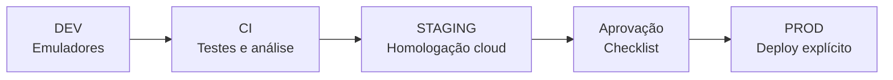

# Ambientes do Okan

**Classificação:** contrato operacional obrigatório  
**Revisado em:** 1º de setembro de 2026  
**Regra central:** um binário conhece exatamente um ambiente e nunca faz fallback silencioso para outro

## 1. Matriz canônica

| Ambiente | Firebase Project ID | Dados | Infraestrutura | Uso |
| --- | --- | --- | --- | --- |
| DEV | `demo-okan-dev` | sintéticos, descartáveis | Emulator Suite local | desenvolvimento e testes rápidos |
| STAGING | `okan-staging-24829` | sintéticos cloud | projeto Firebase real e isolado | homologação integrada |
| PROD | `app-academia-2914d` | reais | projeto Firebase real | usuários finais |

O Firestore canônico e as novas Cloud Functions usam `southamerica-east1`. O alias `default` do Firebase CLI aponta para PROD; portanto, todo comando de deploy deve informar o target explicitamente.

## 2. Invariantes

1. DEV não acessa recursos cloud do Okan.
2. STAGING não lê, escreve, chama Function nem recebe segredo de PROD.
3. PROD não usa dados sintéticos de homologação.
4. configuração ausente, inválida ou contraditória falha antes do bootstrap funcional;
5. pagamentos externos somente podem ser habilitados em PROD;
6. dados de PROD não são copiados para STAGING ou DEV;
7. um deploy deve declarar projeto, região e artefato;
8. segredos e credenciais de serviço são separados por ambiente.

## 3. Seleção de ambiente no Flutter

No Android, o aplicativo combina product flavors com `dart-define`:

| Ambiente | Flavor | Define obrigatório | Identidade visual |
| --- | --- | --- | --- |
| DEV | `dev` | `OKAN_ENV=dev` | título DEV e configuração local |
| STAGING | `staging` | `OKAN_ENV=staging` + 11 valores Firebase | banner `STAGING` |
| PROD | `prod` | `OKAN_ENV=prod` ou default controlado | identidade de produção |

Flavor e `OKAN_ENV` divergentes são erro. DEV recebe o sufixo de application ID `.dev`; STAGING e PROD usam o identificador registrado correspondente ao artefato. O projeto iOS ainda não contém schemes equivalentes `dev`, `staging` e `prod`; até que sejam criados e testados, os comandos com `--flavor` deste documento são específicos do Android.

### Comandos mínimos no Android

```bash
# DEV
flutter run --flavor dev --dart-define=OKAN_ENV=dev

# STAGING: prefira um arquivo local não versionado
flutter run --flavor staging \
  --dart-define=OKAN_ENV=staging \
  --dart-define-from-file=config/staging.local.json

# PROD: somente no processo de release
flutter build appbundle --flavor prod --dart-define=OKAN_ENV=prod
```

O repositório não deve conter `staging.local.json`, arquivos de conta de serviço ou segredos. As chaves de configuração cliente do Firebase não são tratadas como segredo, mas ficam externas ao código para evitar mistura de projeto.

## 4. DEV

### 4.1 Serviços

| Serviço | Host | Porta |
| --- | --- | ---: |
| Auth Emulator | `127.0.0.1` | 9099 |
| Firestore Emulator | `127.0.0.1` | 8080 |
| Functions Emulator | `127.0.0.1` | 5001 |
| Storage Emulator | `127.0.0.1` | 9199 |
| Emulator UI | conforme Firebase CLI | normalmente 4000 |

Para Android Emulator, o app traduz o host local para `10.0.2.2` quando necessário. Dispositivo físico exige um host da rede de desenvolvimento configurado de forma explícita.

### 4.2 Bootstrap

No repositório canônico de backend:

```bash
firebase emulators:start \
  --project demo-okan-dev \
  --only auth,firestore,functions,storage
```

Em outro terminal, no `okan_app`:

```bash
flutter pub get
flutter run --flavor dev --dart-define=OKAN_ENV=dev
```

### 4.3 Controles

- App Check: desativado;
- FCM/push: bootstrap desativado;
- Crashlytics: desativado;
- pagamentos externos: bloqueados;
- secrets de PROD/STAGING: proibidos;
- dados: fixtures ou criação manual, nunca dump de PROD;
- logs: `debug` permitido localmente, respeitando a política de dados.

## 5. STAGING

STAGING é cloud real, começa vazio e existe para validar Auth, Rules, Functions, Storage, FCM e Crashlytics em condições próximas de PROD sem usar dados ou pagamentos reais.

### 5.1 Aplicações Firebase registradas

| Plataforma | Identificador |
| --- | --- |
| Android app ID | `1:993246251446:android:c7e12e7f386b5c67cf1917` |
| iOS app ID | `1:993246251446:ios:f967c9a4bb950311cf1917` |
| Web app ID | `1:993246251446:web:829ca869de1d79f3cf1917` |
| Android application ID | `com.sankofa.okan` |
| iOS bundle ID | `com.sankofa.okan` |

### 5.2 `dart-defines` obrigatórios

```text
OKAN_STAGING_FIREBASE_PROJECT_ID
OKAN_STAGING_FIREBASE_MESSAGING_SENDER_ID
OKAN_STAGING_FIREBASE_STORAGE_BUCKET
OKAN_STAGING_FIREBASE_WEB_API_KEY
OKAN_STAGING_FIREBASE_WEB_APP_ID
OKAN_STAGING_FIREBASE_WEB_AUTH_DOMAIN
OKAN_STAGING_FIREBASE_ANDROID_API_KEY
OKAN_STAGING_FIREBASE_ANDROID_APP_ID
OKAN_STAGING_FIREBASE_IOS_API_KEY
OKAN_STAGING_FIREBASE_IOS_APP_ID
OKAN_STAGING_FIREBASE_IOS_BUNDLE_ID
```

O valor de `OKAN_STAGING_FIREBASE_PROJECT_ID` deve ser exatamente `okan-staging-24829`. Os demais devem estar presentes e formar uma configuração coerente. Ausência ou project ID diferente interrompe a inicialização.

Exemplo de arquivo local:

```json
{
  "OKAN_STAGING_FIREBASE_PROJECT_ID": "okan-staging-24829",
  "OKAN_STAGING_FIREBASE_MESSAGING_SENDER_ID": "993246251446",
  "OKAN_STAGING_FIREBASE_STORAGE_BUCKET": "<bucket-staging>",
  "OKAN_STAGING_FIREBASE_WEB_API_KEY": "<web-api-key>",
  "OKAN_STAGING_FIREBASE_WEB_APP_ID": "1:993246251446:web:829ca869de1d79f3cf1917",
  "OKAN_STAGING_FIREBASE_WEB_AUTH_DOMAIN": "<auth-domain-staging>",
  "OKAN_STAGING_FIREBASE_ANDROID_API_KEY": "<android-api-key>",
  "OKAN_STAGING_FIREBASE_ANDROID_APP_ID": "1:993246251446:android:c7e12e7f386b5c67cf1917",
  "OKAN_STAGING_FIREBASE_IOS_API_KEY": "<ios-api-key>",
  "OKAN_STAGING_FIREBASE_IOS_APP_ID": "1:993246251446:ios:f967c9a4bb950311cf1917",
  "OKAN_STAGING_FIREBASE_IOS_BUNDLE_ID": "com.sankofa.okan"
}
```

### 5.3 Controles

- App Check no cliente: ativado;
- enforcement server-side: deve ser verificado antes de cada gate; as Callables atuais ainda não declaram `enforceAppCheck: true`;
- FCM: ativado para testes controlados;
- Crashlytics Android: ativado;
- pagamentos externos: bloqueados no cliente e ausentes do conjunto seguro de Functions implantado;
- dados: usuários e academias sintéticos identificáveis;
- Functions homologadas: Callables canônicas de academia, licença, convite e vínculo;
- Functions de pagamento, assinatura, push genérico e triggers automáticos: não implantar até aprovação específica.

### 5.4 Validação integrada

Antes de declarar uma versão homologada:

1. confirmar banner `STAGING` e project ID em log sanitizado;
2. criar usuário sintético e autenticar;
3. validar leitura/escrita permitida e uma negação esperada de Rules;
4. executar convite, aceite e desvinculação;
5. executar concessão/revogação de licença com contas de teste;
6. validar upload em path permitido e bloqueio em path desconhecido;
7. validar recebimento de FCM sem conteúdo sensível;
8. enviar erro não fatal controlado ao Crashlytics;
9. confirmar que nenhum artefato aparece em PROD;
10. confirmar que checkout e chamadas de pagamento falham fechadas.

## 6. PROD

PROD contém dados pessoais reais e é o único ambiente autorizado a executar o ciclo financeiro externo.

### Controles

- App Check cliente: ativado; enforcement é requisito de hardening e deve ser auditado no console/código;
- FCM e Crashlytics: ativados conforme plataforma suportada;
- Mercado Pago: permitido somente por Functions server-side com secrets de PROD;
- acesso manual a dados: excepcional, auditável e por menor privilégio;
- logs: somente campos permitidos e minimizados;
- deploy: target explícito, checks verdes, aprovação e rollback preparado;
- dados sintéticos: proibidos, salvo contas internas formalmente identificadas e governadas.

## 7. Firebase CLI e deploy

Aliases canônicos do `okan_backend/.firebaserc`:

```text
default  -> app-academia-2914d
staging  -> okan-staging-24829
dev      -> demo-okan-dev
```

Nunca confiar no alias corrente do terminal. Exemplos seguros:

```bash
# Testes locais
firebase emulators:exec \
  --project demo-okan-dev \
  --only firestore,storage,functions \
  "npm test"

# Homologação: apenas recursos explicitamente aprovados
firebase deploy \
  --project okan-staging-24829 \
  --only firestore:rules,firestore:indexes,storage,functions:<nome>

# Produção: executar somente pelo runbook de release
firebase deploy \
  --project app-academia-2914d \
  --only <escopo-aprovado>
```

Deploy amplo de `functions` em STAGING é proibido enquanto `compatibility_index.js` for responsável por isolar o subconjunto seguro.

## 8. App Check por ambiente

| Plataforma | DEV | STAGING | PROD |
| --- | --- | --- | --- |
| Android debug | off | Debug Provider/token registrado | somente em teste controlado |
| Android release | off | Play Integrity | Play Integrity |
| Apple debug | off | Debug Provider/token registrado | somente em teste controlado |
| Apple release | off | DeviceCheck | DeviceCheck |
| Web administrativo | n/a | não possui modo staging consolidado | reCAPTCHA v3 |

Debug tokens são credenciais operacionais: não versionar, não registrar em logs e revogar quando não forem mais necessários.

## 9. Notificações

- DEV não inicializa push;
- STAGING usa projeto, APNs/FCM credentials e tokens próprios;
- PROD usa credenciais e tokens próprios;
- payload não transporta anamnese, avaliação, nota privada, token, segredo ou outro dado sensível;
- um token FCM nunca é reutilizado entre ambientes;
- o handler background inicializa a mesma configuração resolvida pelo foreground.

## 10. Pagamentos

| Operação | DEV | STAGING | PROD |
| --- | --- | --- | --- |
| consultar catálogo local/mock | permitido | permitido sem transacionar | permitido |
| criar PIX/cartão externo | bloqueado | bloqueado | permitido |
| webhook Mercado Pago | não exposto | não exposto por padrão | exposto e validado |
| secret Mercado Pago PROD | proibido | proibido | Secret Manager |
| simular entitlement | fixture/emulador | ferramenta controlada | proibido |

Ocultar o botão não é controle suficiente. A proteção existe no `enableExternalPayments`, no conjunto de Functions implantado e na ausência de secrets fora de PROD.

## 11. Painel web

O `okan_web` atual contém configuração Firebase de PROD em `public/script/firebase.js` e ainda não oferece seleção fail-closed de ambiente. Consequências:

- não usar o painel atual para homologar STAGING;
- não servir esse build em domínio de STAGING;
- implementar configuração por build/hosting target antes do primeiro fluxo administrativo cloud de STAGING;
- manter Rules e Functions como controles efetivos, independentemente da UI.

## 12. Fail-closed

O processo deve abortar quando ocorrer qualquer uma destas condições:

- ambiente desconhecido;
- flavor e `OKAN_ENV` divergentes;
- project ID inesperado;
- configuração STAGING incompleta;
- tentativa de pagamento fora de PROD;
- tentativa de usar emulador em STAGING/PROD;
- tentativa de usar credencial de PROD fora de PROD;
- bootstrap foreground/background resolve ambientes diferentes;
- comando de deploy sem `--project` explícito;
- artefato não exibe a identidade visual esperada.

## 13. Promoção entre ambientes

Código é promovido; dados e secrets não.



Cada etapa gera evidência: SHA, versão, resultado dos checks, project ID e responsável pela aprovação.

## 14. Referências

- [OKAN-038 — Ambiente DEV](OKAN-038-DEV-ENVIRONMENT.md)
- [OKAN-039 — Ambiente STAGING](OKAN-039-STAGING-ENVIRONMENT.md)
- [Arquitetura](ARCHITECTURE.md)
- [Segurança](SECURITY.md)
- [Modelo de dados](DATA-MODEL.md)

Os documentos de ticket registram a implementação no momento da entrega. Este documento mestre prevalece quando houver evolução posterior comprovada no código ou na infraestrutura.
