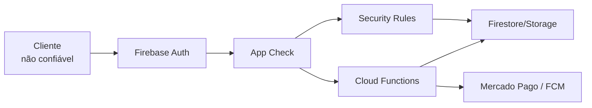

# Autorização e Segurança do Okan

**Classificação:** documento de controle obrigatório  
**Revisado em:** 1º de setembro de 2026  
**Princípio:** negar por padrão e conceder somente a operação necessária

## 1. Fronteira de confiança

Flutter, navegador e qualquer cliente REST são considerados não confiáveis. Firebase Authentication identifica o usuário; autorização depende de Rules e validação server-side.

Campos financeiros, privilégios, assinatura, entitlement, ownership de academia e contadores de licença são server-owned.

## 2. Papéis e personas

| Valor | Finalidade | Privilégios principais |
| --- | --- | --- |
| `aluno` | role comum | próprio perfil e dados permitidos |
| `professor` | role comum | identidade comum; atuação mobile depende de memberType |
| `gym_admin` | RBAC B2B | própria academia sob dupla verificação |
| `super_admin` | RBAC operacional | operações explicitamente permitidas |
| `memberType=aluno` | persona mobile | jornadas de aluno |
| `memberType=professor` | persona mobile | jornadas profissionais |

- `role` e `memberType` não são intercambiáveis;
- vínculo professor–aluno não concede role;
- `gym_admin` não recebe acesso a saúde;
- `super_admin` não recebe acesso médico automático;
- privilégios atuais são lidos de `users/{uid}.role`, protegido contra alteração client-side. Custom Claims são possível evolução, não estado atual.

## 3. Autenticação

- provedores atuais: e-mail/senha e Google;
- sessão autenticada deve ser validada antes de dados protegidos;
- e-mail no novo perfil deve coincidir com `request.auth.token.email`;
- verificação de e-mail é requisito de UX quando aplicável, mas não substitui Rules;
- mensagens de erro não devem revelar existência de conta além do necessário;
- logout deve limpar sessão local, não dados persistidos;
- exclusão de conta precisa de fluxo coordenado entre Auth e Firestore; a Rule isolada de exclusão do documento não apaga subcoleções nem Auth.

## 4. Firestore Rules

Arquivo canônico: `okan_backend/firestore.rules`.

### 4.1 Invariantes

- fallback global: `allow read, write: if false`;
- usuário não altera `uid`, e-mail, role, assinatura, academia, vínculo, notes legadas ou compras;
- `invites`, entitlements e licenças são backend-only;
- saúde usa ownership/vínculo, não apenas autenticação;
- academia usa role + `academyId` + `ownerUid`;
- chat e Arena usam participação explícita;
- catálogo global é escrito somente por super admin.

### 4.2 Resumo

| Path | Leitura | Escrita client-side |
| --- | --- | --- |
| `users/{uid}` | qualquer autenticado — dívida | próprio usuário em allowlist; professor em resumo físico limitado; super admin |
| `users/{uid}/medical` | dono ou professor vinculado | somente dono |
| `users/{uid}/assessments` | dono ou professor vinculado | dono ou professor vinculado |
| `users/{uid}/private_notes/{professorId}` | professor vinculado e autor | mesmo professor |
| `users/{uid}/entitlements` | dono | nenhuma |
| `invites` | envolvidos | nenhuma |
| `workout_plans` | aluno ou professor vinculado | aluno/professor; exclusão só professor |
| `workout_history` | aluno ou professor vinculado | mesmos, preservando owner |
| `workouts` | autenticado | professor proprietário |
| `workout_templates` | autenticado | professor proprietário ou super admin |
| `exercises` | autenticado | super admin |
| `academias` | autenticado | campos limitados ou backend |
| `academias/*/professores` | owner/super admin | nenhuma |

### 4.3 Dívidas conhecidas

1. `users` ainda permite leitura a qualquer autenticado para busca por e-mail e recursos sociais. Isso expõe mais perfil do que o mínimo necessário.
2. `notifications` aceita create de qualquer autenticado; pode permitir spam ou falsificação de conteúdo.
3. `workouts` possui leitura autenticada ampla por compatibilidade.
4. Admin authorization ainda depende de role em Firestore, não Custom Claims.

Destino: `public_profiles` mínimo, notificações críticas server-side e leitura estrita por domínio.

## 5. Storage Rules

Arquivo canônico: `okan_backend/storage.rules`.

| Path | Leitura | Escrita |
| --- | --- | --- |
| `user_photos/{uid}.jpg` | autenticados | próprio UID, até 10 MB |
| `profile_photos/{uid}.jpg` | autenticados | próprio UID, até 10 MB; legado |
| `arena_duels/{challengeId}/{timestamp}_{uid}.jpg` | participantes | participante, até 10 MB |
| qualquer outro | negada | negada |

### Hardening pendente

- validar `contentType` de imagem, não apenas extensão/tamanho;
- reduzir tamanho se a experiência permitir;
- migrar e remover `profile_photos`;
- avaliar exclusão server-side de objetos da Arena para evitar confiar no cliente.

## 6. App Check

### Estado atual

- Flutter DEV: desativado;
- Flutter STAGING/PROD: ativado;
- Android release: Play Integrity;
- Android debug: Debug Provider;
- Apple release: DeviceCheck; debug: Debug Provider;
- painel PROD: reCAPTCHA v3.

### Limite importante

Ativação do SDK não prova enforcement do produto Firebase. As Callables atuais não declaram `enforceAppCheck: true`. Antes de classificar um endpoint como protegido por App Check:

1. confirmar enforcement no código/console do ambiente;
2. registrar debug tokens somente fora de PROD;
3. testar token ausente, inválido e válido;
4. habilitar com rollout e monitorar bloqueios;
5. manter mecanismo de rollback controlado.

## 7. Proteção das Functions

Cada Callable privilegiada deve:

- exigir `request.auth.uid`;
- ignorar UID de ator enviado no payload;
- validar role/persona no Firestore canônico;
- validar ownership e estado atual;
- normalizar strings, e-mails, IDs, quantidade e enums;
- executar mutações relacionadas em Transaction/Batch;
- ser idempotente quando retries são possíveis;
- converter erros internos em códigos HttpsError sanitizados;
- não retornar stack, documento completo ou segredo.

Webhooks HTTP devem validar assinatura, resource ID, idempotência e origem antes de produzir efeito. Schedules não recebem confiança de payload externo.

## 8. Secrets

Secrets atuais:

- `MERCADO_PAGO_ACCESS_TOKEN`;
- `MERCADO_PAGO_WEBHOOK_SECRET`.

Regras:

- armazenar em Google Secret Manager/Firebase Secrets;
- declarar dependência apenas nas Functions que usam o segredo;
- nunca colocar em Dart, JavaScript do navegador, `.env` versionado, `firebase.json`, README ou ticket;
- rotacionar após suspeita de exposição;
- não usar segredo de PROD em DEV/STAGING;
- chave pública do Mercado Pago não é segredo, mas deve ser separada por ambiente.

## 9. Dados proibidos em logs

Nunca registrar:

- senha ou código de recuperação;
- ID token, refresh token ou App Check token;
- Access Token/Webhook Secret do Mercado Pago;
- token de cartão, número de cartão ou CVV;
- CPF/CNPJ completo quando não estritamente necessário;
- FCM token completo;
- anamnese, avaliação, nota privada ou texto médico;
- e-mail, nome, UID ou relação professor–aluno em métricas agregadas;
- payload bruto de webhook;
- URL assinada de Storage.

Campos permitidos quando necessários e minimizados:

- nome estável do evento;
- ambiente e plataforma;
- código de erro sanitizado;
- nome da Function;
- status técnico;
- ID de correlação opaco;
- contadores agregados;
- versão/build sem identidade.

## 10. Política por ambiente

| Controle | DEV | STAGING | PROD |
| --- | --- | --- | --- |
| Dados | sintéticos/local | sintéticos cloud | reais |
| App Check cliente | off | on | on |
| App Check enforcement | não aplicável | validar antes do gate | obrigatório como destino |
| Pagamento externo | proibido | proibido | permitido |
| Push | off | cliente on; trigger genérico não implantado | on |
| Crashlytics Android | off | on | on |
| Verbosidade de log | debug local, sem PII | info/warn/error | warn/error e eventos operacionais |
| Secrets PROD | proibidos | proibidos | somente Secret Manager |

Nenhum ambiente pode fazer fallback silencioso para PROD.

## 11. Threat model resumido

| Ameaça | Vetor | Controle | Residual |
| --- | --- | --- | --- |
| Autoelevação | editar `users.role` | Rules bloqueiam campos | role Firestore exige proteção operacional |
| Premium gratuito | editar `isPremium`/compras | server-owned + entitlement | compatibilidade legada precisa observação |
| Preço adulterado | APK/JS modificado | catálogo server-side | chave pública/UX não é controle |
| Replay de webhook | evento duplicado | `webhook_events` + fulfillment determinístico | validar assinatura e disponibilidade |
| IDOR em saúde | trocar `studentId` | ownership + vínculo em Rules | leitura ampla de root `users` permanece |
| Licenças acima do limite | concorrência | Firestore Transaction | reconciliação operacional |
| Spam de notificações | create client-side | autenticação apenas | risco aberto; mover ao backend |
| Abuso de Storage | upload grande/tipo inválido | owner/participante + 10 MB | MIME ainda não validado |
| Mistura de ambiente | config incorreta | IDs fixos e fail-closed | web admin ainda PROD-only |
| Vazamento em observabilidade | logs/payloads | allowlist e proibições | revisão contínua necessária |

## 12. Testes obrigatórios

- Firestore Rules: owner, vínculo, role, academia, chats, Arena, client_state e negativas;
- Storage Rules: autenticação, owner, participante, tamanho, path desconhecido;
- Functions: auth ausente, role errada, ownership, payload inválido, concorrência e idempotência;
- pagamento: preço adulterado, webhook inválido/duplicado, estado não aprovado e entitlement único;
- ambientes: project ID inesperado, STAGING incompleto e ausência de fallback.

## 13. Resposta a incidente de segurança

1. interromper deploys e preservar evidências;
2. classificar dado, usuários e ambientes afetados;
3. revogar/rotacionar credenciais quando aplicável;
4. bloquear vetor com mudança mínima e testada;
5. validar STAGING e implantar target explícito;
6. revisar logs sem ampliar exposição;
7. comunicar responsáveis e cumprir obrigações LGPD;
8. registrar causa raiz, linha do tempo, correção e prevenção;
9. atualizar Runbook, Rules/tests e este documento.

## 14. Gate para merge

Mudança de segurança não pode ser mergeada quando:

- introduz allow global;
- depende apenas da UI;
- escreve campo server-owned pelo cliente;
- não possui caso negativo;
- loga dados proibidos;
- mistura ambientes;
- remove compatibilidade sem evidência;
- usa secret fora do gerenciador;
- altera Rule sem Emulator test.
